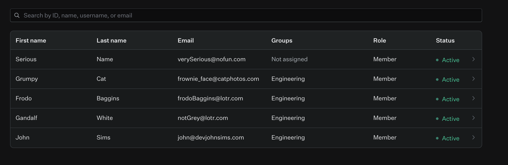

# WorkOS SSO & Directory Demo

A minimal Node.js/Express app demonstrating:

1. **WorkOS SSO**
   - Okta SAML
   - Google OAuth
   - Microsoft OAuth
2. **WorkOS Directory Sync**
   - Fetching & displaying SCIM-provisioned users from Okta

---

## Prerequisites

- **Node.js** v14+ and **npm**
- **Git** (to clone the repo)

---

## Setup & Run

### 1. Clone & install

```bash
git clone https://github.com/simzeee/WorkOS_take_home
cd WorkOS_take_home
npm install
```

### 2. Add .env

- Add a .env file in the root directory and copy over the variables and values sent in the email (Alexander or Betsy should have them!)

These are the required variables:

# example .env

```bash
WORKOS_CLIENT_ID=your-workos-client-id
WORKOS_API_KEY=sk_test_…
ORGANIZATION_ID=org_…
DIRECTORY_ID=directory_…
SESSION_SECRET=some-long-random-string
REDIRECT_URI=http://localhost:8000/callback
NODE_ENV=development
```

### 3. Run the app

```bash
npm run start
```

The app will be at http://localhost:8000

## 🔑 Testing the Flows

### 1. Enterprise SAML (Okta)

- On the home page, click **Enterprise SAML**
- Sign in with an Okta user **assigned** to the SAML app
- You’ll land on the success page showing your first & last name (see screen recording below for working example)
- Note: the user would have to ask me to add them to my Okta org and assign them to this app, so this won't work!

### 2. Google OAuth

- Click **Google OAuth**
- Authenticate with **any** Google account
- You’ll land on the same success page

### 3. Microsoft OAuth

- Click **Microsoft OAuth**
- Authenticate with **any** Microsoft account
- You’ll land on the same success page

### 4. Directory Users

- From the success page, click **See All Directory Users**
- You’ll see a centered grid of cards, each showing:

  - A circular avatar (with initials)
  - First & last name
  - Email address

- You'll see it matches this list from the WorkOS Directory:



### Screen Recordings

I emailed the .mov files to the team! But, here are some .gifs of the same thing.

#### Successful Login

- 

#### Unsuccessful Login (outside Okta Tenant)

- 

#### Please let me know if you have any questions!!
